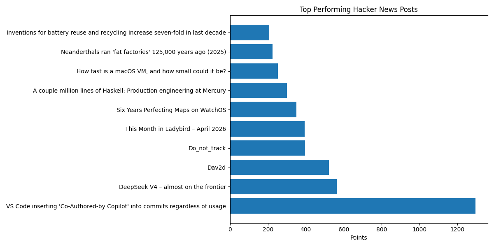
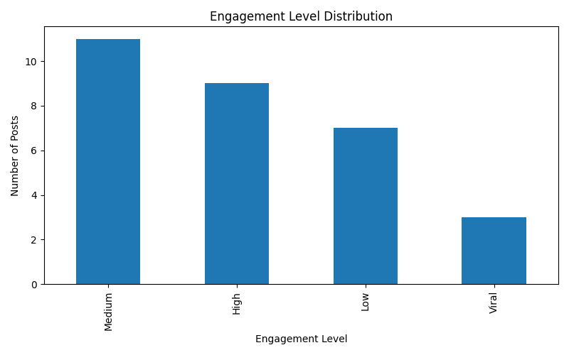

# Hacker News Content Performance Analytics

## Project Overview

This project analyzes Hacker News content performance to identify engagement patterns, trending topics, and high-performing posts within online technology communities.

Using Python, SQL, SQLite, and data visualization, the project transforms raw Hacker News data into actionable content intelligence through automated data cleaning, KPI analysis, feature engineering, and SQL-based analytics.

The project simulates a real-world analytics workflow commonly used in business intelligence and data analytics environments.

---

## Business Problem

Technology communities generate large volumes of user-generated content daily. Understanding which content characteristics drive visibility and engagement can help platforms optimize content discovery, improve recommendation systems, and better understand audience interests.

This project aims to answer questions such as:

- Which posts generate the highest engagement?
- What characteristics define high-performing content?
- How is engagement distributed across posts?
- Do question-based titles perform differently?
- What trends emerge among viral posts?

---

## Dataset

The dataset contains scraped Hacker News post data including:

- Post titles
- URLs
- Points (engagement score)
- Publishing time
- Engagement categories
- Custom performance scores

---

## Tech Stack

- Python
- Pandas
- SQLite
- SQL
- Matplotlib
- Seaborn
- VS Code

---

## Project Workflow

```plaintext
Raw Data
   ↓
Data Cleaning
   ↓
Feature Engineering
   ↓
KPI Analysis
   ↓
SQL Analytics
   ↓
Visualization Generation
   ↓
Cleaned Dataset Export
```

---

## Project Structure

```plaintext
news-kpi/
│
├── data/
│   ├── raw/
│   └── cleaned/
│
├── visuals/
│
├── sql/
│   └── engagement_queries.sql
│
├── main.py
├── data_cleaning.py
├── feature_engineering.py
├── kpi_analysis.py
├── visualization.py
├── create_database.py
├── run_queries.py
├── hackernews.db
└── README.md
```

---

## Feature Engineering

Additional analytical features were created to support KPI analysis and content intelligence.

### Engineered Features

- `title_length`
- `word_count`
- `is_question`
- `is_viral`
- `performance_score`

These features were used to analyze engagement patterns and content characteristics.

---

## KPI Framework

The project tracks several performance KPIs including:

- Average post points
- Highest scoring posts
- Average performance score
- Viral post frequency
- Average title length
- Engagement distribution

### Example KPI Results

| KPI | Value |
|---|---|
| Average Points | 201.43 |
| Highest Points | 1296 |
| Average Performance Score | 13.14 |
| Viral Posts | 3 |
| Average Title Length | 51.73 |

---

## SQL Analytics

SQLite was integrated into the project to perform structured analytical querying on cleaned Hacker News data.

### Example SQL Query

```sql
SELECT
    title,
    points
FROM hackernews_posts
ORDER BY points DESC
LIMIT 10;
```

### SQL Operations Used

- GROUP BY
- ORDER BY
- Aggregate Functions
- Filtering
- Ranking Analysis

### SQL Analysis Objectives

- Identify top-performing posts
- Analyze engagement distribution
- Detect viral content
- Compare performance metrics
- Evaluate title-based engagement patterns

---

## Visualizations

The project automatically generates analytical visualizations including:

- Top-performing posts chart
- Engagement distribution analysis
- KPI performance visuals

### Top Performing Hacker News Posts



---

### Engagement Distribution



---

## Key Insights

- A small percentage of posts generated disproportionately high engagement levels.
- Viral content represented only a limited portion of total posts, indicating highly concentrated audience attention.
- Technology and AI-related topics consistently ranked among the highest-performing content categories.
- Question-based and concise titles showed stronger engagement patterns.
- Engagement distribution demonstrated significant skewness, with a small number of posts dominating visibility.

---

## Automation & Pipeline Design

The project was designed as a modular analytics pipeline where each component handles a dedicated stage of the workflow.

### Modules

| File | Purpose |
|---|---|
| `data_cleaning.py` | Cleans and standardizes raw data |
| `feature_engineering.py` | Creates analytical features |
| `kpi_analysis.py` | Generates KPI summaries |
| `visualization.py` | Creates and exports charts |
| `create_database.py` | Builds SQLite database |
| `run_queries.py` | Executes SQL analysis |

---

## Example Output

```plaintext
--- KPI SUMMARY ---

Average Points: 201.43
Highest Points: 1296
Average Performance Score: 13.14
Viral Posts: 3
Average Title Length: 51.73

Pipeline completed successfully.
```

---

## Future Improvements

Potential future enhancements include:

- NLP-based topic modeling
- Sentiment analysis
- Real-time Hacker News API integration
- Interactive Streamlit dashboard
- Predictive engagement modeling
- Time-series trend analysis

---

## Skills Demonstrated

- Data Cleaning
- Exploratory Data Analysis
- Feature Engineering
- KPI Development
- SQL Analytics
- SQLite Database Integration
- Data Visualization
- Modular Python Development
- Business Intelligence Analytics

---

## Conclusion

This project demonstrates an end-to-end analytics workflow for analyzing content performance and engagement trends using Python, SQL, and visualization tools.

The analysis combines data engineering, KPI analytics, SQL querying, and visualization techniques to transform raw Hacker News data into structured engagement intelligence suitable for business analysis and decision-making workflows.
